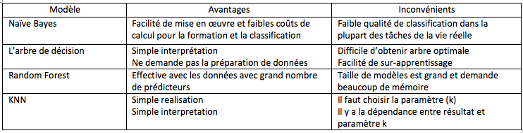

```{r global_options, include=FALSE}
knitr::opts_chunk$set(fig.pos = 'h')
```

# Identifier les étudiants qui ont besoin d’un plan d’aide à la réussite
L’objectif de ce TP - trouver les étudiants qui ont besoin d’un plan d’aide à la réussite (les étudiants qui sont en échec). Construire le modèle prédictif en bas de données existantes lequel aide déterminer les étudiants  qui ont besoin d’aide.
Dans ce cas on a seulement 2 sortis possibles : réussi ou en échec, donc on est dans le cas de classification.

# Exploration des données 
```{r, message=F, warning=F}
library(tidyr)
library(dplyr)
library(ggplot2)
library(corrplot)
library(e1071)
library(rpart)
library(gmodels)
library(randomForest)
library(caret)
library(rpart.plot)
library(class)
library(randomForest)
library(knitr)
library(kableExtra)
library(MLmetrics)
```
1.	Teéleécharge les données dans la variable *students*
```{r}
students <- read.csv("student-data.csv", header=TRUE, sep= ',')
```

2.	Détermine les statistiques suivantes :
 * nombre d'étudiants qui ont réussi, nombre d'étudiants en échec

```{r}
stud_result <- table(students$passed)
print(stud_result)
```


*	nombre d'étudiantes total
```{r}
print(sum(stud_result))
```


*	taux de graduation
```{r}
level_grad <- round(stud_result["yes"]/ sum(stud_result), 2)
print(level_grad)
```

Dans l'échantillon étudié, les deux tiers des étudiants ont terminé ses études avec succés.

3.	Distribution d'âge des étudiants qui ont réussi / en échec
```{r}
ggplot(data = students) + 
  geom_boxplot(mapping = aes(x = passed, y = age))
```
 
```{r}
table(students$passed, students$age)
```

4.	Age, graduation et gendre
```{r}
ggplot(data = students, aes(x = age)) + 
  geom_bar(aes(fill = passed), position = "dodge") + 
  facet_grid(~ sex) + 
  ggtitle("Dépendance entre réussite et âge et gendre")
```

5.	Dépendance entre la graduation et le lieu de résidence
```{r, message=F, warning=F}
students_passed <- students %>%
  filter(passed == "yes")
students_failed <- students %>%
  filter(passed == "no")
```

```{r}
prop.table(table(students_passed$address))
```

```{r}
prop.table(table(students_failed$address))
```

```{r}
prop.table(table(students$address))
```

Les résultats obtenus montrent que les taux de graduation entre les étudiants qui habitent en ville et à la compagne presque les même. 

6.	Absences et réussite
```{r}
ggplot(data = students, aes(x= absences)) + 
  geom_histogram(binwidth = 5) + 
  facet_grid(~ passed) + 
  theme(plot.title = element_text(hjust = 0.5)) +
  ggtitle("Absences et reussuté")
```

7.	Graduation et désir d'obtenir d'enseignement supérieur
```{r}
table(students$passed, students$higher)
```  

```{r}
prop.table(table(students_passed$higher))
```


```{r}
prop.table(table(students_failed$higher))
```

Presque tous les étudiants de l’échantillon souhaiteraient poursuivre des études supérieures, mais parmi ceux qui en échec, le pourcentage est légèrement inférieur.

8.	Raison de choix d'école
```{r}
ggplot(data = students, aes(x= reason)) + 
  geom_bar(aes(fill = passed), position = "dodge") +
  theme(plot.title = element_text(hjust = 0.5)) +
  ggtitle("Graduation et choix d'école")
```

 
```{r}
prop.table((table(students_passed$reason)))
```

```{r}
prop.table((table(students_failed$reason)))
```

9.	Graduation, éducation des parents et supervision
```{r}
ggplot(data = students, aes(x = guardian)) + 
  geom_bar(aes(fill = passed), position = "dodge") + 
  facet_grid(~ Medu) +
  theme(plot.title = element_text(hjust = 0.5)) +
  ggtitle("Graduation - Education de mère et supervision")
```

```{r}
ggplot(data = students, aes(x = guardian)) + 
  geom_bar(aes(fill = passed), position = "dodge") + 
  facet_grid(~ Fedu) +
  theme(plot.title = element_text(hjust = 0.5)) +
  ggtitle("Graduation - Education de père et supervision")
```

#Préparation des données
Faire les petites modifications aux données.
Remplacer toutes les variables catégoriques par des variables numeriques: 
- dans les colonnes avec 2 valeurs ("yes" et "no") remplace "yes" par 1 et "no" par 0;
- les colonnes restantes avec des valeurs catégoriques divise en colonnes différentes.

```{r}
studentsModif <- students %>%
  mutate(value = 1) %>%
  spread(school, value) %>%
  mutate(value = 1) %>%
  spread(sex, value) %>%
  mutate(value = 1) %>%
  spread(address, value) %>%
  mutate(value = 1) %>%
  spread(famsize, value) %>%
  mutate(value = 1) %>%
  spread(Pstatus, value) %>%
  mutate(value = 1) %>%
  spread(reason, value) %>%
  mutate(value = 1) %>%
  spread(guardian, value) %>%
  mutate(schoolsup_01 = ifelse(schoolsup =='yes', 1, 0)) %>%
  mutate(famsup_01 = ifelse(famsup =='yes', 1, 0)) %>%
  mutate(paid_01 = ifelse(paid =='yes', 1, 0)) %>%
  mutate(higher_01 = ifelse(higher =='yes', 1, 0)) %>%
  mutate(activities_01 = ifelse(activities =='yes', 1, 0)) %>%
  mutate(nursery_01 = ifelse(nursery =='yes', 1, 0)) %>%
  mutate(internet_01 = ifelse(internet =='yes', 1, 0)) %>%
  mutate(romantic_01 = ifelse(romantic =='yes', 1, 0)) %>%
  mutate(passed_01 = ifelse(passed =='yes', 1, 0)) 

colChoose <- c("GP", "MS", "F", "M", "R", "U", "GT3", "LE3", "A", "T", "course", 
               "home", "reputation", "father", "mother", "other")
studentsModif[colChoose][is.na(studentsModif[colChoose])] <- 0
studentsModif <- studentsModif[c(1,2, 3, 6, 7, 8, 17:23, 25:49)]
names(studentsModif) <- c("age", "Medu", "Fedu", "traveltime", "studytime", "failures", 
                          "famrel", "freetime",  "goout", "Dalc","Walc", "health", 
                          "absences", "school_GP", "school_MS", "sex_F", "sex_M", 
                          "address_R", "address_U", "famsize_GT3", "famsize_LE3", 
                          "Pstatus_A", "Pstatus_T", "reason_course", "reason_home", 
                          "reason_reputation", "guardian_father", "guardial_mother", 
                          "guardian_other", "schoolsup", "famsup", "paid", "higher", 
                          "activities", "nurcery", "internet", "romantic", "passed")
```
##Corrélation entre « passed » et d’autres prédicteurs

```{r}
correlation <- cor(studentsModif, studentsModif$passed)
correlation
```

Choisir seulemenet quelques variables les plus interessantes pour l'analyse (où la correlation est plus élevée) :
```{r}
corr <- round(cor(studentsModif[c(1, 2, 3, 6, 9, 29, 33, 38)]), 2)
corrplot(corr, method = "color", tl.col = "black", addCoef.col="black")
```

Comme prédicteurs ne prennent que le colonnes avec une corrélation la plus élevée:
```{r}
students <- students[c("age", "Medu", "Fedu", "failures", "goout", 
                       "guardian", "higher", "passed")]
head(students)
```

Préparer les données pour les modèles. Diviser les données en 2 partie – train et test avec les 3 version:
1. train - 80%, test - 20%
2. train - 100 enregistrements
3. train - 200 enregistrements
4. train - 300 enregistrements
Le test-set rest le même pour les autres trains sets.
Colonne « passed » - est notre cible, les autres - les prèdicteurs.

```{r, message=F, warning=F}
train <- list(students[1:316,], students[1:100, ], students[1:200, ], students[1:300, ])
test <- students[317:395,]

```
#Modèle d’apprentissage et test évaluation 
D'abord, nous considérons tous les modèles qui seront utilisés dans ce TP en termes d'avantages et d'inconvénients.
```{r out.width= '100%'}

```
    

##1.	Naïve Bayes

```{r}
time_fit <- list()
time_pred <- list()
f1_train <- list()
f1_test <- list()
for (i in c(1, 2, 3, 4)) {
  start_time<- Sys.time()
  modelBayes<- naiveBayes(train[[i]][, -8], train[[i]][, 8])
  end_time <- Sys.time()
  time_fit[i] <- round(end_time - start_time, 4)
  start_time<- Sys.time()
  predictedBayes <- predict(modelBayes, train[[i]][,-8])
  end_time <- Sys.time()
  time_pred[i] <- round(end_time - start_time, 4)
  f1_train[i] <- round(F1_Score(predictedBayes, train[[i]][,8]), 2)
  predictedBayes <- predict(modelBayes, test[,-8])
  f1_test[i] <- round(F1_Score(predictedBayes, test[,8]), 2)
}
```

Estimation de modèle:
```{r}
result_table <- array( 
  c("nbr elements", '80%', 100, 200, 300,
    "time fit", time_fit[1], time_fit[2], time_fit[3], time_fit[4],
     "f1_score_train", f1_train[1], f1_train[2], f1_train[3], f1_train[4],
     "time predict", time_pred[1], time_pred[2], time_pred[3], time_pred[4],
     "f1 score test", f1_test[1], f1_test[2], f1_test[3], f1_test[4]), 
  dim = c(5, 5))
result_table %>% kable() %>% kable_styling()
```

## 2.	L’arbre de décision
```{r, warning=F}
time_fit <- list()
time_pred <- list()
f1_train <- list()
f1_test <- list()
for (i in c(1, 2, 3, 4)) {
  start_time<- Sys.time()
  modelDT <- rpart(passed ~ ., data = train[[i]])
  end_time <- Sys.time()
  time_fit[i] <- round(end_time - start_time, 4)
  start_time<- Sys.time()
  predictedDT <- predict(modelDT, train[[i]], type="class")
  end_time <- Sys.time()
  time_pred[i] <- round(end_time - start_time, 4)
  f1_train[i] <- round(F1_Score(predictedDT, train[[i]][,8]), 2)
  predictedDT <- predict(modelDT, test, type="class")
  f1_test[i] <- round(F1_Score(predictedDT, test[,8]), 2)
}
```

Estimation de modèle:
```{r}
result_table <- array( 
  c("nbr elements", '80%', 100, 200, 300,
    "time fit", time_fit[1], time_fit[2], time_fit[3], time_fit[4],
     "f1_score_train", f1_train[1], f1_train[2], f1_train[3], f1_train[4],
     "time predict", time_pred[1], time_pred[2], time_pred[3], time_pred[4],
     "f1 score test", f1_test[1], f1_test[2], f1_test[3], f1_test[4]), 
  dim = c(5, 5))
result_table %>% kable() %>% kable_styling()
```

## 3. Random Forest
```{r}
time_fit <- list()
time_pred <- list()
f1_train <- list()
f1_test <- list()
for (i in c(1, 2, 3, 4)) {
  start_time<- Sys.time()
  modelRF <- randomForest(passed ~ ., data = train[[i]])
  end_time <- Sys.time()
  time_fit[i] <- round(end_time - start_time, 4)
  print(modelRF)
  predictedRF <- predict(modelRF, test)
  f1_test[i] <- round(F1_Score(predictedRF, test[,8]), 2)
}
```
Estimation de modèle:
```{r}
result_table <- array( 
  c("nbr elements", '80%', 100, 200, 300,
    "time fit", time_fit[1], time_fit[2], time_fit[3], time_fit[4],
    "f1 score test", f1_test[1], f1_test[2], f1_test[3], f1_test[4]), 
  dim = c(5, 3))
result_table %>% kable() %>% kable_styling()
```
Essayeons d'optimiser le modèle. On utilise la méthode cross-validation. Définir *trainControl* (cross-validation avec 10 folders) créer le modèle:

```{r, message=F, warning=F}
f1 <- function(data, lev = NULL, model = NULL) {
  f1_val <- F1_Score(y_pred = data$pred, y_true = data$obs, positive = lev[1])
  c(F1 = f1_val)
}

trControl <- trainControl(method = "cv", number = 10, summaryFunction = f1)
time_fit <- list()
f1_train <- list()
f1_test <- list()
for (i in c(1, 2, 3, 4)) {
  start_time<- Sys.time()
  modelRF_cv <- train(passed ~ ., data = train[[i]], method = "rf",
                     metric = "F1", trControl = trControl)
  end_time <- Sys.time()
  time_fit[i] <- round(end_time - start_time, 4)
  f1_train[i] <- round(max(modelRF_cv$results$F1), 2)
  predictedRF <- predict(modelRF_cv, test)
  f1_test[i] <- round(F1_Score(predictedRF, test[,8]), 2)
}

```

Estimation de modèle:
```{r}
result_table <- array( 
  c("nbr elements", '80%', 100, 200, 300,
    "time fit", time_fit[1], time_fit[2], time_fit[3], time_fit[4],
    "f1_score_train", f1_train[1], f1_train[2], f1_train[3], f1_train[4],
    "f1 score test", f1_test[1], f1_test[2], f1_test[3], f1_test[4]), 
  dim = c(5, 4))
result_table %>% kable() %>% kable_styling()
```
## 4. KNN
```{r, message=F, warning=F}
time_fit <- list()
f1_train <- list()
f1_test <- list()
for (i in c(1, 2, 3, 4)) {
  start_time<- Sys.time()
  modelKnn <- train(passed ~ ., data = train[[i]], method = "knn",
                    metric = "F1", trControl = trControl, tuneGrid   = expand.grid(k = 5))
  end_time <- Sys.time()
  time_fit[i] <- round(end_time - start_time, 4)
  f1_train[i] <- round(max(modelKnn$results$F1), 2)
  predictedKnn <- predict(modelKnn, test)
  f1_test[i] <- round(F1_Score(predictedKnn, test[,8]), 2)
}
```
```{r}
result_table <- array( 
  c("nbr elements", '80%', 100, 200, 300,
    "time fit", time_fit[1], time_fit[2], time_fit[3], time_fit[4],
    "f1_score_train", f1_train[1], f1_train[2], f1_train[3], f1_train[4],
    "f1 score test", f1_test[1], f1_test[2], f1_test[3], f1_test[4]), 
  dim = c(5, 4))
result_table %>% kable() %>% kable_styling()
```
#Choix du meilleur modèle

  Dans ce TP 4 modèles différents ont été construits pour prédire la réussite des étudiantes. <br />
Comme une métrique pour évaluer la qualité des modèles a été sélectionnée F1-score. <br />
Chaque modèle a été construit pour 4 différents training set et a été testé sur le même test set. Pour chaque modèle et chaque training set, on a évalué la qualité et le temps d'apprentissage et temps de prédiction. <br />

  En comparant les résultats, on peut dire qu’en termes d’évaluation de la qualité, les modèles travaillent prèsque également. Qualité légèrement supérieure pour les modèles qui a été construit sur un train avec 200 et 300 éléments. <br />

  En point de vue de temps d'e travail'execution, de meilleurs résultats montrent L’arbre de décision et Naïve Bayes. <br />

  Parce que dans les données initiales, la quantite des étudiantes qui ont réussi  et des étudiants qui sont en échecn'étaient pas égale (taux de la réussite = 0.67), les modèles appris sur ces données prédisent avec plus de précision les résultats pour les étudiants qui réussissent. <br />
  
  En conclusion, on peut dire que les meilleurs résultats du point de vue de tous les indicateurs estimés ont été obtenus avec un modèle d'arbre de décision avec training set de 300 enregistrements.
